# Note importante concernant l'exécution des scripts SQL

Dans les requêtes suivantes, nous prendrons en compte la période de notre étude (en fusionnant tous les semestres). Si vous souhaitez obtenir les données pour chaque semestre individuel, il vous suffit de remplacer la date de la période souhaitée dans la condition "creation_date".

### Execution des scripts
Pour exécuter le script SQL et obtenir les résultats, suivez ces étapes :

- Ouvrez une interface SQL ou un outil de requête compatible avec BigQuery.
- Copiez la requête SQL ci-dessus et collez-la dans l'interface.
- Assurez-vous d'être connecté à la base de données publique de BigQuery de Stack Overflow.
- Après la première requête intitulée "# Analyse des questions Stack Overflow liées à "GitHub Actions"", veillez à enregistrer les résultats en tant que table BigQuery sous le nom "vital-program-390504.nath.final" pour les requêtes ultérieures utilisant cette table. Vous avez la possibilité de nommer la table selon votre préférence, mais assurez-vous de faire les modifications nécessaires dans les requêtes qui font référence à cette table.
- Exécutez la requête SQL.

### Note importante pour le jeu de données

L'un des éléments clés de ce Répertoire GitHub est le fichier nath.json. Ce fichier JSON contient l'ensemble des questions sur lesquelles notre 
étude s'est concentrée. Il est impératif de souligner que l’utilisation précise de ce fichier est cruciale pour obtenir des résultats identiques aux nôtres. En effet, toute régénération pourrait engendrer des incohérences dans les résultats obtenus, puisque certaines questions pourraient être supprimées ou pourraient recevoir des réponses, altérant ainsi la validité et la comparabilité des analyses effectuées.

# Analyse des questions Stack Overflow liées à "GitHub Actions"

Dans cette analyse, nous allons compter le nombre total de questions posées sur Stack Overflow entre le 1er juillet 2018 et le 30 juin 2022, qui sont liées à "GitHub Actions". Pour ce faire, nous allons effectuer une requête SQL sur la base de données publique de BigQuery de Stack Overflow.

## Requête SQL

La requête SQL ci-dessous sélectionne le nombre total de questions qui satisfont les critères spécifiés :

Elles ont été créées entre le 1er juillet 2018 et le 30 juin 2022.
Le titre ou le corps de la question contient le terme "GitHub Actions" (en ignorant la casse).
Elles sont taguées avec "github-actions".

```sql
SELECT count(*)
FROM `bigquery-public-data.stackoverflow.posts_questions`
WHERE 
    creation_date BETWEEN '2018-07-01 00:00:00' AND '2022-06-30 23:59:59'
    AND (
        LOWER(title) LIKE '%github actions%' 
        OR LOWER(body) LIKE '%github actions%' 
        
        OR id IN (
            SELECT id
            FROM (
                SELECT id, SPLIT(tags, '|') tags
                FROM `bigquery-public-data.stackoverflow.posts_questions`
                WHERE creation_date BETWEEN '2018-07-01 00:00:00' AND '2022-06-30 23:59:59'
            ) 
            CROSS JOIN UNNEST(tags) flattened_tags
            WHERE LOWER(flattened_tags) = 'github-actions'
        )
    );
```


### Résultat

Le résultat de la requête SQL est le nombre total de questions qui répondent à ces critères, dans notre cas, **6149** questions.

### Conclusion

Grâce à cette analyse, nous avons pu compter le nombre de questions liées à "GitHub Actions" posées sur Stack Overflow au cours de la période spécifiée. 


# Analyse des Mentions de "GitHub Actions" dans les Historiques des Posts

Dans cette analyse, nous comptons le nombre total d'occurrences où l'expression "GitHub Actions" a été mentionnée dans les historiques des posts de Stack Overflow entre le 1er juillet 2018 et le 30 juin 2022.

## Requête SQL

Pour obtenir le nombre d'occurrences où "GitHub Actions" a été mentionné dans les historiques des posts, la requête SQL suivante peut être utilisée :

```sql
SELECT COUNT(post_id)
FROM `bigquery-public-data.stackoverflow.post_history`
WHERE creation_date BETWEEN '2018-07-01 00:00:00' AND '2022-06-30 23:59:59'
AND (LOWER(text) LIKE '%github actions%');
```


### Résultat

Après avoir exécuté la requête SQL, nous obtenons le nombre total d'occurrences où "GitHub Actions" a été mentionné, soit **9897** occurrences.

#### Conclusion

Cette analyse révèle que l'expression "GitHub Actions" a été mentionnée **9897** fois dans les historiques des posts de Stack Overflow entre juillet 2018 et juin 2022. Cela suggère une utilisation significative de GitHub Actions dans les discussions et les interactions des développeurs sur la plateforme.


 
# Analyse des Questions avec Réponses Acceptées

Dans cette analyse, nous allons compter le nombre total de questions ayant des réponses acceptées sur Stack Overflow entre le 1er juillet 2018 et le 30 juin 2022.

### Requête SQL

Pour obtenir le nombre de questions avec des réponses acceptées, la requête SQL suivante peut être utilisée :

```sql
SELECT COUNT(*)
FROM `vital-program-390504.nath.final`
WHERE creation_date BETWEEN '2018-07-01 00:00:00' AND '2022-06-30 23:59:59'
  AND accepted_answer_id IS NOT NULL;
```

### Résultat

Après avoir exécuté la requête SQL, nous obtenons le nombre total de **2389** questions avec des réponses acceptées.

### Conclusion

Cette analyse nous permet de déterminer le nombre de questions sur Stack Overflow ayant des réponses acceptées entre juillet 2018 et juin 2022. Cela peut nous fournir des informations importantes sur l'engagement de la communauté envers la résolution de problèmes et la qualité des réponses fournies.


# Analyse des Questions sans Réponses Acceptées

Dans cette analyse, nous allons compter le nombre total de questions n'ayant pas de réponse acceptée sur Stack Overflow entre le 1er juillet 2018 et le 30 juin 2022.

## Requête SQL

Pour obtenir le nombre de questions sans réponse acceptée, la requête SQL suivante peut être utilisée :

```sql
SELECT COUNT(*)
FROM `vital-program-390504.nath.final`
WHERE creation_date BETWEEN '2018-07-01 00:00:00' AND '2022-06-30 23:59:59'
  AND accepted_answer_id IS NULL;
```
### Résultat

Après avoir exécuté la requête SQL, nous obtenons le nombre total de **3760** questions sans réponse acceptée.

### Conclusion

Cette analyse nous permet de déterminer le nombre de questions sur Stack Overflow qui n'ont pas de réponse acceptée entre juillet 2018 et juin 2022. Cela peut nous fournir des informations intéressantes sur les domaines où la communauté peut avoir besoin d'une assistance supplémentaire ou où les réponses peuvent ne pas être considérées comme résolues.


# Analyse des Questions sans Réponses

Dans cette analyse, nous allons compter le nombre total de questions qui n'ont aucune réponse sur Stack Overflow entre le 1er juillet 2018 et le 30 juin 2022.

## Requête SQL

Pour obtenir le nombre de questions sans réponses, la requête SQL suivante peut être utilisée :

```sql
SELECT COUNT(*)
FROM `vital-program-390504.nath.final`
WHERE creation_date BETWEEN '2018-07-01 00:00:00' AND '2022-06-30 23:59:59'
  AND answer_count = 0 . 
```

  #### Résultat

Après avoir exécuté la requête SQL, nous obtenons le nombre total de **1725** questions sans réponse.

### Conclusion

Cette analyse nous permet de déterminer le nombre de questions sur Stack Overflow qui n'ont pas de réponse entre juillet 2018 et juin 2022. Cela peut nous fournir des informations sur les sujets pour lesquels les réponses sont moins fréquentes ou peut-être plus difficiles à obtenir.


# Analyse des Questions avec Réponses

Dans cette analyse, nous allons compter le nombre total de questions qui ont au moins une réponse sur Stack Overflow entre le 1er juillet 2018 et le 30 juin 2022.

## Requête SQL

Pour obtenir le nombre de questions avec au moins une réponse, la requête SQL suivante peut être utilisée :

```sql
SELECT COUNT(*)
FROM `vital-program-390504.nath.final`
WHERE creation_date BETWEEN '2018-07-01 00:00:00' AND '2022-06-30 23:59:59'
  AND answer_count > 0;
```

  ### Résultat

Après avoir exécuté la requête SQL, nous obtenons le nombre total de **4424** questions avec au moins une réponse.

### Conclusion

Cette analyse nous permet de déterminer le nombre de questions sur Stack Overflow qui ont au moins une réponse entre juillet 2018 et juin 2022. Cela peut nous fournir des informations sur les sujets qui suscitent des discussions actives et des interactions au sein de la communauté des développeurs.


# Analyse des Utilisateurs Actifs

Dans cette analyse, nous allons extraire les informations sur les utilisateurs actifs de Stack Overflow entre le 1er juillet 2018 et le 30 juin 2022. Un utilisateur est considéré comme actif s'il a posé une question ou fourni une réponse pendant cette période.

## Requête SQL

Pour obtenir les informations sur les utilisateurs actifs, la requête SQL suivante peut être utilisée :

```sql
SELECT DISTINCT
  u.id AS user_id,
  u.display_name AS user_name
FROM (
  SELECT id AS post_id, owner_user_id
  FROM `vital-program-390504.nath.final`
  WHERE creation_date BETWEEN '2018-07-01 00:00:00' AND '2022-06-30 23:59:59'
  
) AS q
LEFT JOIN (
  SELECT parent_id, owner_user_id
  FROM `bigquery-public-data.stackoverflow.posts_answers`
  WHERE creation_date BETWEEN '2018-07-01 00:00:00' AND '2022-06-30 23:59:59'
) AS a
ON q.post_id = a.parent_id
JOIN `bigquery-public-data.stackoverflow.users` AS u
ON (q.owner_user_id = u.id OR a.owner_user_id = u.id);

```

 ### Résultat

Après avoir exécuté la requête SQL, nous obtenons le nombre total de **6986** des utilisateurs distincts.

### Conclusion

Cette analyse nous permet d'identifier les utilisateurs actifs de Stack Overflow pendant la période de juillet 2018 à juin 2022. En combinant les informations sur les questions et les réponses, nous pouvons avoir un aperçu des membres actifs de la communauté qui contribuent activement à la plateforme.

# Analyse des Tags Stack Overflow

Dans cette analyse, nous allons compter et calculer la proportion des tags les plus courants sur Stack Overflow entre le 1er juillet 2018 et le 30 juin 2022".

## Requête SQL

Pour obtenir les informations sur les tags les plus courants, la requête SQL suivante peut être utilisée :

```sql
WITH TagCounts AS (
  SELECT tag, COUNT(*) AS tag_count
  FROM (
    SELECT SPLIT(tags, '|') AS tags
    FROM `vital-program-390504.nath.final`
    WHERE  creation_date BETWEEN '2018-07-01 00:00:00' AND '2022-06-30 23:59:59'
  )
  CROSS JOIN UNNEST(tags) AS tag
  WHERE tag != 'github-actions'
  GROUP BY tag
)

SELECT
  'github-action' AS tag,
  COUNT(*) AS tag_count,
  (COUNT(*) * 100.0 / SUM(COUNT(*)) OVER ()) AS percentage
FROM `vital-program-390504.nath.final`
WHERE  creation_date BETWEEN '2018-07-01 00:00:00' AND '2022-06-30 23:59:59'
UNION ALL
SELECT
  tag,
  tag_count,
  (tag_count * 100.0 / SUM(tag_count) OVER ()) AS percentage
FROM TagCounts
ORDER BY tag_count DESC;

```

### Résultat

Après avoir exécuté le script SQL, vous obtiendrez une liste des tags les plus courants avec le nombre de mentions (tag_count) ainsi que le pourcentage.

### Conclusion

Cette analyse nous permet de déterminer les tags les plus courants sur Stack Overflow entre juillet 2018 et juin 2022. Cela peut nous fournir des informations sur les sujets les plus discutés au sein de la communauté des développeurs.


# Analyse des Tags Moyens par Question

Dans cette analyse, nous allons calculer le nombre moyen de tags par question sur Stack Overflow entre le 1er juillet 2018 et le 30 juin 2022.

## Requête SQL

Pour calculer le nombre moyen de tags par question, la requête SQL suivante peut être utilisée :

```sql
WITH TagCounts AS (
  SELECT id, ARRAY_LENGTH(SPLIT(tags, '|')) AS tag_count
  FROM `vital-program-390504.nath.final`
  WHERE creation_date BETWEEN '2018-07-01 00:00:00' AND '2022-06-30 23:59:59'
)

SELECT
  'Average Tags per Question' AS tag,
  ROUND(AVG(tag_count), 2) AS average_tags_per_question
FROM TagCounts;

```
### Résultat

Après avoir exécuté la requête SQL, vous obtiendrez le nombre moyen de tags par question (3.18), arrondi à deux décimales.

### Conclusion

Cette analyse nous permet de calculer le nombre moyen de tags par question sur Stack Overflow pendant la période de juillet 2018 à juin 2022. Cela peut nous fournir des informations sur la façon dont les questions sont étiquetées et catégorisées par la communauté des développeurs.


# Analyse des Réponses Moyennes par Question

Dans cette analyse, nous allons calculer le nombre moyen de réponses par question sur Stack Overflow entre le 1er juillet 2018 et le 30 juin 2022.

## Requête SQL

Pour calculer le nombre moyen de réponses par question, la requête SQL suivante peut être utilisée :

```sql
SELECT
  'Average Answers per Question' AS metric,
  ROUND(AVG(answer_count), 2) AS average_answers_per_question
FROM (
  SELECT parent_id, COUNT(*) AS answer_count
  FROM `bigquery-public-data.stackoverflow.posts_answers`
  WHERE parent_id IN (
    SELECT id
    FROM `vital-program-390504.nath.final`
    WHERE creation_date BETWEEN '2018-07-01 00:00:00' AND '2022-06-30 23:59:59'
  )
  GROUP BY parent_id
);
```

### Résultat

Après avoir exécuté la requête SQL, vous obtiendrez le nombre moyen de réponses par question (1.38), arrondi à deux décimales.

### Conclusion

Cette analyse nous permet de calculer le nombre moyen de réponses par question sur Stack Overflow pendant la période de juillet 2018 à juin 2022. Cela peut nous fournir des informations sur la fréquence des interactions et des discussions autour des questions posées par la communauté des développeurs.


# Note importante concernant l'exécution des scripts Python (Jupyter Notebook)

## Importer les packages pour les stopwords

```python
import nltk
nltk.download("stopwords")
```

## Importer les packages necessaires pour l'exécution du programme

```python
import numpy as np
import json
import glob

import re
import string

#Gensim
import gensim
import gensim.corpora as corpora
from gensim.utils import simple_preprocess
from gensim.models import CoherenceModel

#spacy
import spacy
from nltk.corpus import stopwords
from nltk.corpus import stopwords

#vis
import pyLDAvis
import pyLDAvis.gensim
from sklearn.manifold import MDS


import warnings
warnings.filterwarnings("ignore", category=DeprecationWarning)
```

## Prétraitement de Données Textuelles pour le Traitement Automatique du Langage Naturel

```python

def preprocess_text(text):
    # Remove the word "action"
   # Remove the words "action" and "github"
    text = re.sub(r'\b(?:action|github|actions)\b', '', text, flags=re.IGNORECASE)
    
    # Remove code snippets enclosed in <code> tags
    text = re.sub(r'<code>(.*?)</code>', '', text, flags=re.DOTALL)
    
    # Remove HTML tags
    text = re.sub('<[^<]+?>', '', text)
    
    # Remove URLs
    text = re.sub(r'http\S+|www\S+', '', text)
    
    # Remove numbers
    text = re.sub(r'\d+', '', text)
    
    # Remove punctuation marks
    text = text.translate(str.maketrans('', '', string.punctuation))
    
    # Convert to lowercase
    text = text.lower()
    
    # Remove leading/trailing white spaces
    text = text.strip()
    
    return text

def load_data(file):
    with open(file, "r", encoding="utf-8") as f:
        data = json.load(f)
        texts = []
        for item in data:
            title = item["title"]
            body = item["body"]
            question_text = title + " " + body
            preprocessed_text = preprocess_text(question_text)
            texts.append(preprocessed_text)
        return texts
    
def write_data(file, data):
    with open(file, "w", encoding="utf-8") as f:
        json.dump(data, f, indent=4)
        
file_path = "nath.json"
corpus = load_data(file_path)
write_data("preprocessed_data.json", corpus)
     
```

## Chargement et Affichage des Données Textuelles Prétraitées depuis le Fichier 'nath.json'

```python
data = load_data("nath.json")

print (data[0])
```
### Output
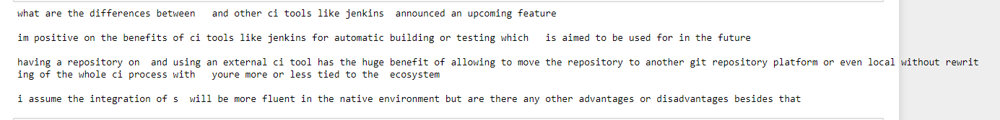


## Lemmatisation de Textes en Utilisant spaCy pour le Traitement Automatique du Langage 

```python

def lemmatization(texts, allowed_postags=["NOUN", "ADJ", "VERB", "ADV"]):
    nlp = spacy.load("en_core_web_sm", disable=["parser", "ner"])
    texts_out = []
    for text in texts:
        doc = nlp(text)
        new_text = []
        for token in doc:
            if token.pos_ in allowed_postags:
                new_text.append(token.lemma_)
                
        final = " ".join(new_text)
        texts_out.append(final)
    return (texts_out)


lemmatized_texts = lemmatization(data)
print (lemmatized_texts[0])
```

### Output
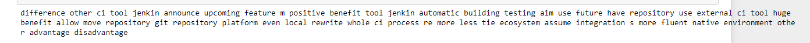

## Extraction de Mots à partir de Textes Lemmatisés en Utilisant gensim pour le Traitement Automatique du Langage Naturel

```python
def gen_words(texts):
    final = []
    for text in texts:
        new = gensim.utils.simple_preprocess( text, deacc=True)
        final.append(new)
        
    return (final)

data_words = gen_words(lemmatized_texts)

print (data_words[0])
```
### Output
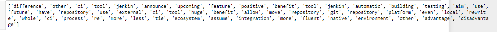


## Génération de Bigrammes et Trigrammes à partir de Mots Extraits, Utilisation de gensim pour le Traitement Automatique du Langage Naturel

```python
bigrams_phrases = gensim.models.Phrases(data_words, min_count=5, threshold=50)
trigram_phrases = gensim.models.Phrases(bigrams_phrases[data_words], threshold=50)

bigram = gensim.models.phrases.Phraser(bigrams_phrases)
trigram = gensim.models.phrases.Phraser(trigram_phrases)

def make_bigrams(texts):
    return [bigram[doc] for doc in texts]

def make_trigram(texts):
    return [trigram[bigram[doc]] for doc in texts]

data_bigrams = make_bigrams(data_words)
data_bigrams_trigrams = make_trigram(data_bigrams)

print(data_bigrams_trigrams[0])
```

### Output
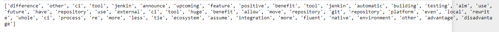

## Création d'un Modèle TF-IDF pour le Traitement de Données Textuelles, Utilisation de gensim

```python
from gensim.models import TfidfModel

id2word = corpora.Dictionary(data_bigrams_trigrams)

texts = data_bigrams_trigrams

corpus = [id2word.doc2bow(text) for text in texts]
print (corpus[0])

tfidf = TfidfModel(corpus, id2word=id2word)

low_value = 0.03
words = []
words_missing_in_tfidf = []
for i in range(0, len(corpus)):
    bow = corpus[i]
    low_value_words = []
    tfidf_ids = [id for id, value in tfidf[bow]]
    bow_ids = [id for id, value in bow]
    low_value_words = [id for id, value in tfidf[bow] if value < low_value]
    drops = low_value_words+words_missing_in_tfidf
    for item in drops:
        words.append(id2word[item])
    words_missing_in_tfidf = [id for id in bow_ids if id not in tfidf_ids]
    
    new_bow = [b for b in bow if b[0] not in low_value_words and b[0] not in words_missing_in_tfidf]
    corpus[i] = new_bow
    
```

### Output
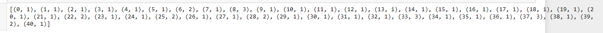

## Calcul de la Taille du Corpus Textuel à partir d'un Fichier JSON dans le Contexte du Traitement Automatique du Langage Naturel

```python
import json

def get_corpus_size(json_file):
    with open(json_file, 'r', encoding='utf-8') as file:
        data = json.load(file)

    num_documents = len(data)
    total_tokens = 0

    for post in data:
        # Assuming the "body" and "title" fields contain the text of the document
        doc_text = post['body'] + " " + post['title']
        words = doc_text.split()  # Split the document into words/tokens
        total_tokens += len(words)

    return num_documents, total_tokens

# Replace 'your_json_file.json' with the path to your JSON file
json_file_path = 'nath.json'
num_documents, total_tokens = get_corpus_size(json_file_path)

print(f"Number of documents in the corpus: {num_documents}")
print(f"Total number of tokens in the corpus: {total_tokens}")

```

### Output
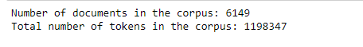

## Utilisation de l'algorithme génétique pour trouver les parametres optimals

```python
import time
import gensim
from gensim.models import LdaModel
from gensim import corpora

# Preprocessed texts
texts = data_bigrams_trigrams  # Your preprocessed texts here

# Create a dictionary from the texts
dictionary = corpora.Dictionary(data_bigrams_trigrams)

# Create a corpus (bag of words representation)
corpus = [dictionary.doc2bow(text) for text in texts]

# Define the ranges for the parameters
num_topics_range = range(5, 15)  # Number of topics: 2 to 50
num_iterations_range = range(100, 500, 100)  # Number of iterations: 10 to 500 (step size: 10)
chunk_size_range = range(1000, 2000, 100)  # Chunk size: 10 to 200 (step size: 10)
passes_range = range(100, 200, 10)  # Number of passes: 1 to 100

# Initialize variables for tracking the optimal parameters and coherence score
optimal_params = {}
max_coherence_score = 0

# Start measuring the overall execution time
start_time = time.time()

# Iterate over the parameter ranges and train LDA models
for num_topics in num_topics_range:
    for num_iterations in num_iterations_range:
        for chunk_size in chunk_size_range:
            for passes in passes_range:
                # Start measuring the execution time for each LDA model
                model_start_time = time.time()

                lda_model = LdaModel(corpus=corpus,
                                     id2word=dictionary,
                                     num_topics=num_topics,
                                     iterations=num_iterations,
                                     chunksize=chunk_size,
                                     random_state=100)
                # Calculate coherence score
                coherence_model = gensim.models.CoherenceModel(model=lda_model, texts=texts, dictionary=dictionary, coherence='c_v')
                coherence_score = coherence_model.get_coherence()

                # Check if current coherence score is higher than previous max
                if coherence_score > max_coherence_score:
                    max_coherence_score = coherence_score
                    optimal_params = {
                        'num_topics': num_topics,
                        'num_iterations': num_iterations,
                        'chunk_size': chunk_size,
                        'passes': passes
                    }

                # Calculate the elapsed time for the current LDA model
                model_elapsed_time = time.time() - model_start_time
                print("Elapsed Time for Model (Topics: {}, Iterations: {}, Chunk Size: {}, Passes: {}): {:.2f} seconds, Coherence Score: {:.4f}".format(num_topics, num_iterations, chunk_size, passes, model_elapsed_time, coherence_score))

# Calculate the overall elapsed time
elapsed_time = time.time() - start_time

# Print the optimal parameters and coherence score
print("Optimal Parameters:")
print("Number of Topics:", optimal_params['num_topics'])
print("Number of Iterations:", optimal_params['num_iterations'])
print("Chunk Size:", optimal_params['chunk_size'])
print("Passes:", optimal_params['passes'])
print("Coherence Score:", max_coherence_score)
print("Overall Execution Time: {:.2f} seconds".format(elapsed_time))


```
### Output
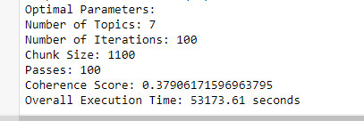

## Création d'un Modèle de Topic Modeling LDA (Latent Dirichlet Allocation)

```python
lda_model = gensim.models.ldamodel.LdaModel(corpus=corpus, 
                                            id2word=id2word, 
                                            num_topics = 7,
                                            passes = 100,
                                            chunksize = 1100,
                                            iterations=100,
                                            alpha = 'auto',
                                            eta = 'auto',
                                            random_state = 100
                                            ) 

```

## Visualisation des clusters

```python
#warnings.filterwarnings('ignore', category=FutureWarning)
pyLDAvis.enable_notebook()
vis = pyLDAvis.gensim.prepare(lda_model, corpus, id2word, mds="mmds", R=10)
vis
```

### Output
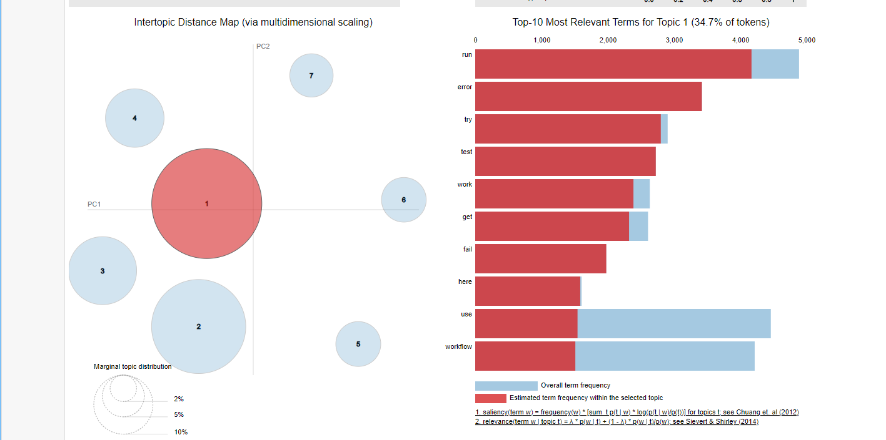

## Distribution de documents entre les topics identifiés

```python
lfrom gensim.models.ldamodel import LdaModel
from gensim import corpora

# Get the number of topics from the LDA model
num_topics = lda_model.num_topics

# Initialize a list to store the count of documents for each topic
topic_doc_count = [0] * num_topics

# Iterate through the corpus and count the documents associated with each topic
for document_bow in corpus:
    dominant_topic = max(lda_model[document_bow], key=lambda x: x[1])[0]
    topic_doc_count[dominant_topic] += 1

# Print the number of documents associated with each topic
for topic, doc_count in enumerate(topic_doc_count):
    print(f"Topic {topic}: Number of Documents: {doc_count}")

```

### Output
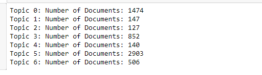

## Utilisation de LDA pour trouver la moyenne des favori, vue et score de chaque sujet.

```python
import json
from gensim.models import LdaModel
from gensim import corpora

# Step 1: Read data from the JSON file
with open('nath.json', 'r', encoding='utf-8') as json_file:
    data_list = json.load(json_file)


# Step 3: Associate topics with documents and find the dominant topic for each document
doc_topics = [lda_model.get_document_topics(doc) for doc in corpus]
dominant_topics = [max(doc_topics, key=lambda x: x[1])[0] for doc_topics in doc_topics]

# Step 4: Group data points (documents) based on their associated topics
topics_data = {topic_id: [] for topic_id in range(lda_model.num_topics)}
for doc_id, topic_id in enumerate(dominant_topics):
    topics_data[topic_id].append(data_list[doc_id])

# Step 5: Initialize dictionaries to store sums and counts for each topic
sum_fav_count_per_topic = {}
sum_score_per_topic = {}
sum_view_count_per_topic = {}
num_documents_per_topic = {}

# Step 6: Calculate sums and counts for each topic
for topic_id, documents in topics_data.items():
    sum_fav_count = 0
    sum_score = 0
    sum_view_count = 0
    num_documents = len(documents)

    for document in documents:
        fav_count = document.get('favorite_count')
        score = document.get('score')
        view_count = document.get('view_count')

        if fav_count is not None:
            sum_fav_count += int(fav_count)
        if score is not None:
            sum_score += int(score)
        if view_count is not None:
            sum_view_count += int(view_count)

    sum_fav_count_per_topic[topic_id] = sum_fav_count
    sum_score_per_topic[topic_id] = sum_score
    sum_view_count_per_topic[topic_id] = sum_view_count
    num_documents_per_topic[topic_id] = num_documents

# Print averages and topic keywords for each topic
for topic_id in range(lda_model.num_topics):
    num_documents = num_documents_per_topic[topic_id]
    if num_documents > 0:
        avg_fav_count = sum_fav_count_per_topic[topic_id] / num_documents
        avg_score = sum_score_per_topic[topic_id] / num_documents
        avg_view_count = sum_view_count_per_topic[topic_id] / num_documents

        print(f"Topic {topic_id}:")
        print(f"Topic Keywords: {', '.join([word for word, _ in lda_model.show_topic(topic_id)])}")
        print(f"Average favorite count: {avg_fav_count:.2f}")
        print(f"Average score: {avg_score:.2f}")
        print(f"Average view count: {avg_view_count:.2f}")
        print()


```

### Output
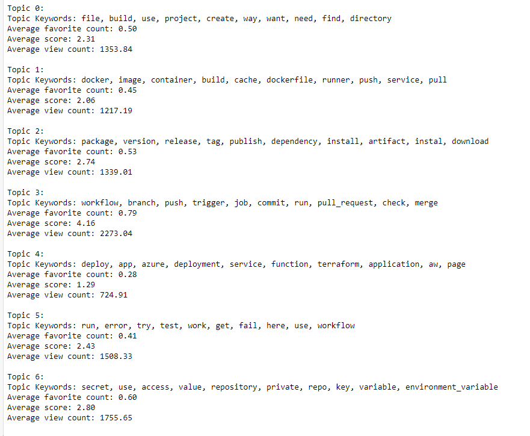

## Utilisation de LDA pour trouver la moyenne des favori, vue et score de toutes les questions.

```python
# Step 1: Read data from the JSON file
with open('nath.json', 'r', encoding='utf-8') as json_file:
    data_list = json.load(json_file)


# Step 3: Associate topics with documents and find the dominant topic for each document
doc_topics = [lda_model.get_document_topics(doc) for doc in corpus]
dominant_topics = [max(doc_topics, key=lambda x: x[1])[0] for doc_topics in doc_topics]

# Step 4: Group data points (documents) based on their associated topics
topics_data = {topic_id: [] for topic_id in range(lda_model.num_topics)}
for doc_id, topic_id in enumerate(dominant_topics):
    topics_data[topic_id].append(data_list[doc_id])

# Step 5: Initialize dictionaries to store sums and counts for each topic
sum_fav_count_per_topic = {}
sum_score_per_topic = {}
sum_view_count_per_topic = {}
num_documents_per_topic = {}

# Step 6: Calculate sums and counts for each topic
for topic_id, documents in topics_data.items():
    sum_fav_count = 0
    sum_score = 0
    sum_view_count = 0
    num_documents = len(documents)

    for document in documents:
        fav_count = document.get('favorite_count')
        score = document.get('score')
        view_count = document.get('view_count')

        if fav_count is not None:
            sum_fav_count += int(fav_count)
        if score is not None:
            sum_score += int(score)
        if view_count is not None:
            sum_view_count += int(view_count)

    sum_fav_count_per_topic[topic_id] = sum_fav_count
    sum_score_per_topic[topic_id] = sum_score
    sum_view_count_per_topic[topic_id] = sum_view_count
    num_documents_per_topic[topic_id] = num_documents

# Calculate total averages for all questions/topics
total_questions = len(data_list)
total_avg_fav_count = sum(sum_fav_count_per_topic.values()) / total_questions
total_avg_score = sum(sum_score_per_topic.values()) / total_questions
total_avg_view_count = sum(sum_view_count_per_topic.values()) / total_questions

print("Average Attributes for All Topics/Questions:")
print(f"Total Questions: {total_questions}")
print(f"Total Average Favorite Count: {total_avg_fav_count:.2f}")
print(f"Total Average Score: {total_avg_score:.2f}")
print(f"Total Average View Count: {total_avg_view_count:.2f}")
print()

```

### Output
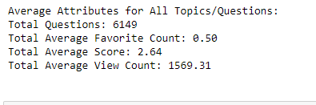

## Utilisation de LDA pour trouver le nombre de question sans reponse et sans reponse accepté pour chacun de sujets.

```python
import json
from gensim.models import LdaModel
from gensim import corpora

# Step 1: Read data from the JSON file
with open('nath.json', 'r', encoding='utf-8') as json_file:
    data_list = json.load(json_file)


# Step 3: Associate topics with documents and find the dominant topic for each document
doc_topics = [lda_model.get_document_topics(doc) for doc in corpus]
dominant_topics = [max(doc_topics, key=lambda x: x[1])[0] for doc_topics in doc_topics]

# Step 4: Group data points (documents) based on their associated topics
topics_data = {topic_id: [] for topic_id in range(lda_model.num_topics)}
for doc_id, topic_id in enumerate(dominant_topics):
    topics_data[topic_id].append(data_list[doc_id])

# Step 5: Initialize dictionaries to store counts for each topic
num_questions_without_accepted_answer = {}
num_questions_without_answer = {}

# Step 6: Calculate counts for each topic
for topic_id, documents in topics_data.items():
    num_without_accepted_answer = 0
    num_without_answer = 0

    for document in documents:
        answer_count = int(document.get('answer_count', 0))  # Convert to int
        accepted_answer_id = document.get('accepted_answer_id')

        if answer_count == 0:
            num_without_answer += 1
        if accepted_answer_id is None :
            num_without_accepted_answer += 1

    num_questions_without_answer[topic_id] = num_without_answer
    num_questions_without_accepted_answer[topic_id] = num_without_accepted_answer

# Print the number of questions without an accepted answer and without any answer for each topic
for topic_id in range(lda_model.num_topics):
    print(f"Topic {topic_id}:")
    print(f"Number of questions without an accepted answer: {num_questions_without_accepted_answer[topic_id]}")
    print(f"Number of questions without any answer: {num_questions_without_answer[topic_id]}")
    print()

```

### Output
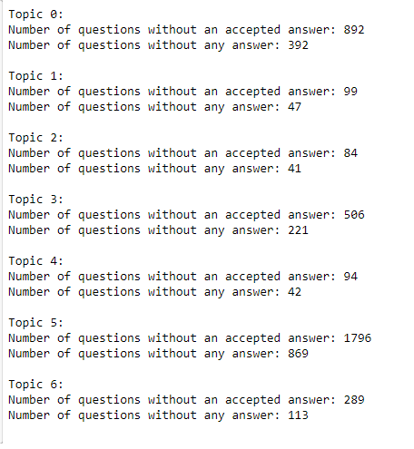